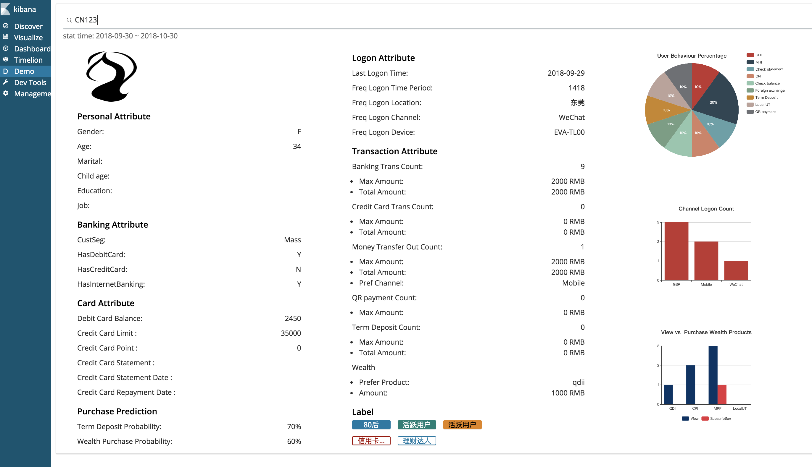

# user personalize page demo

## screenshot


---

## Deveopment Basic
### kibana version  


### path  


## My development

1. use kibana 'node script/generate_plugin demo' to create this repository original file, version is 6.3.2, when you create this plugin need to fill the version, so you need change back kibana package.json's version to align the plugin version, otherwise it will not work.  

2. what I change  
* package.json - I updated eui version to 5, so the react and react-dom also need to update, as the old version has bug that can't recognize the search bar query. I also use echart, as eui has so many bug, no idea how to use it. After added, you need to add plugin-helper back, which use command 'yarn add link:../../kibana/packages/kbn-plugin-helpers' and build again 'yarn kbn bootstrap'  
* server/routes/example.js - is the B/E service part  
* public/components/main/main.js - is the F/E part  
* public/less/main.less - is the css, I updated one to cover the exist component style  

3. example data  
```json  
POST /prd_mi_info_user_attri/doc/CN123
{
  "hasInternetBanking": "Y",
  "@timestamp": "2018-11-06T03:01:15.332Z",
  "hasCreditCard": "N",
  "hasDebitCard": "Y",
  "@version": "1",
  "sex": "F",
  "custId": "CN123",
  "custSeg": "MAS",
  "birthYear": "1985",
  "imgUrl": "https://source.unsplash.com/400x200/?Nature"
}  
```

```json
POST /user_logon_tagging/doc 
{
  "custid": "CN123",
  "lastLogonTime": "2018-09-29T23:59:55.000Z",
  "gspLastLogonTime": "1969-12-31T16:00:00.000Z",
  "mobileZLastLogonTime": "2018-09-29T23:59:52.055Z",
  "wechatLastLogonTime": "1969-12-31T16:00:00.000Z",
  "freqLogonChannel": "Wechat Service Account",
  "freqLogonTimePeriod": "1418",
  "freqDeviceName": "EVA-TL00",
  "freqDeviceCount": 4,
  "freqLogonLoc": "东莞",
  "freqLogonLocCount": 4,
  "creditLimit": 35000,
  "lastCreditLimitTime": "2018-09-28T00:00:00.000Z",
  "pointTotal1": 0,
  "lastPointTotalTime": "1969-12-31T16:00:00.000Z",
  "user_logon_pre_tag_1": "80后",
  "user_logon_pre_tag_2": "N/A",
  "user_logon_pre_tag_3": "活跃用户",
  "user_logon_pre_tag_4": "N/A",
  "user_logon_pre_tag_5": "活跃用户",
  "gspCount": 3,
  "mobileZCount": 2,
  "wechatCount": 1,
  "viewCount": 2,
  "subscribeCount": 0,
  "statementCount": 1,
  "rewardCount": 0,
  "preBindingCount": 1,
  "limitCount": 1,
  "balanceCount": 1,
  "getInstallmentCount": 1,
  "transferCount": 1,
  "openAccountCount": 1,
  "cashInstallInquiryCount": 1,
  "onlinefxCount": 1,
  "timeDepositCount": 1,
  "fundCount": 1,
  "stepupTmdAoCount": 1,
  "opencdCount": 1,
  "debitBalance": 2450,
  "stat_start_time": "2018-09-30T00:00:00.000Z",
  "stat_end_time": "2018-10-30T00:00:00.000Z"
}
```

```json
POST /user_trans_tagging/doc
{
  "custid": "CN123",
  "movemoney_count": 1,
  "movemoney_max_amount_in_cny": 2000,
  "movemoney_total_amount_in_cny": 2000,
  "movemoney_avg_amount_in_cny": 2000,
  "movemoney_gsp_count": 0,
  "movemoney_mobilez_count": 1,
  "movemoney_wechat_count": 0,
  "movemoney_pre_channel": "Mobile",
  "movemoney_cny_local_count": 1,
  "movemoney_cny_fcy_cov_count": 0,
  "movemoney_global_trans_count": 0,
  "movemoney_fcy_cny_cov_count": 0,
  "movemoney_cny_3pp_trans_count": 0,
  "hub_trans_count": 9,
  "hub_trans_count_in_cny": 5,
  "hub_trans_total_amount_in_cny": 2000,
  "hub_trans_max_amount_in_cny": 2000,
  "hub_trans_avg_amount_in_cny": 230.90777778625488,
  "cupd_trans_count": 0,
  "cupd_trans_max_amount": 0,
  "cupd_trans_total_amount": 0,
  "cupd_trans_avg_amount": 0,
  "td_count": 0,
  "td_cfm_count": 0,
  "td_max_amount": 0,
  "td_total_amount": 0,
  "td_avg_amount": 0,
  "qr_pay_count": 0,
  "qr_pay_cfm_count": 0,
  "qr_pay_max_amount": 0,
  "qr_pay_avg_amount": 0,
  "wealth_sub_pre_tag": "qdii",
  "wealth_sub_pre_amount": 1000,
  "user_trans_pre_tag_1": "信用卡积分大户",
  "user_trans_pre_tag_2": "理财达人",
  "user_trans_pre_tag_3": "N/A",
  "td_pred_prob": "70%",
  "wealth_pred_prob": "60%",
  "qdii_count": 1,
  "qdii_sub_count": 0,
  "cpi_count": 2,
  "cpi_cfm_count": 0,
  "mrf_count": 3,
  "mrf_cfm_count": 1
}
```

4. cmd
* cd in demo folder, 'yarn start' to run the kibana and plugin, open localhost:5601
* 'yarn build' to package the plugin zip which can be used to kibana-plugin install file:///path/to/plugin.zip


## development(below is kibana general doc)

See the [kibana contributing guide](https://github.com/elastic/kibana/blob/master/CONTRIBUTING.md) for instructions setting up your development environment. Once you have completed that, use the following yarn scripts.

  - `yarn kbn bootstrap`

    Install dependencies and crosslink Kibana and all projects/plugins.

    > ***IMPORTANT:*** Use this script instead of `yarn` to install dependencies when switching branches, and re-run it whenever your dependencies change.

  - `yarn start`

    Start kibana and have it include this plugin. You can pass any arguments that you would normally send to `bin/kibana`

      ```
      yarn start --elasticsearch.url http://localhost:9220
      ```

  - `yarn build`

    Build a distributable archive of your plugin.

  - `yarn test:browser`

    Run the browser tests in a real web browser.

  - `yarn test:server`

    Run the server tests using mocha.

For more information about any of these commands run `yarn ${task} --help`. For a full list of tasks checkout the `package.json` file, or run `yarn run`.
